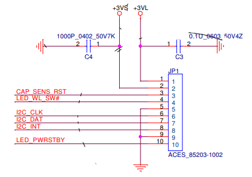

# I2C register/command documentation for the HP 2530p touchbar

device address is 0x28

# Startup

write 0x02 into register 0x00 to clear interrupt

write 0x00 into register 0x01 to initialize LEDs

# Buttons

when the interrupt pin goes high

read 2 bytes from register 0x03 to determine which button is pressed

write 0x02 into register 0x00 to clear interrupt

## Register 0x03 button mapping

- `0b10000000 00000000` - vol up
- `0b01000000 00000000` - vol down
- `0b00100000 00000000` - touchpad
- `0b00001000 00000000` - mute
- `0b00000100 00000000` - presentation
- `0b00000010 00000000` - wireless
- `0b00000001 00000000` - info

the volume slider is fake, it just sends buttonpress events

# LEDs

write 1 byte into register 0x01 to set LED states

## LED register 0x01 mapping

- `0b01000000` - caps lock
- `0b00100000` - num lock
- `0b00010000` - touchpad
- `0b00001000` - mute
- `0b?0000???` - standby

# Other Pin Behaviour (non-i2c)

LED_PWRSTBY: a low-side switched LED output. the LED is on the motherboard  
this probably works similar to the other LEDs on register 0x01

LED_WL_SW#: switches the WIFI LED from orange to blue when pulled low

CAP_SENS_RST: reset the controller chip for all this stuff

# Pinout

